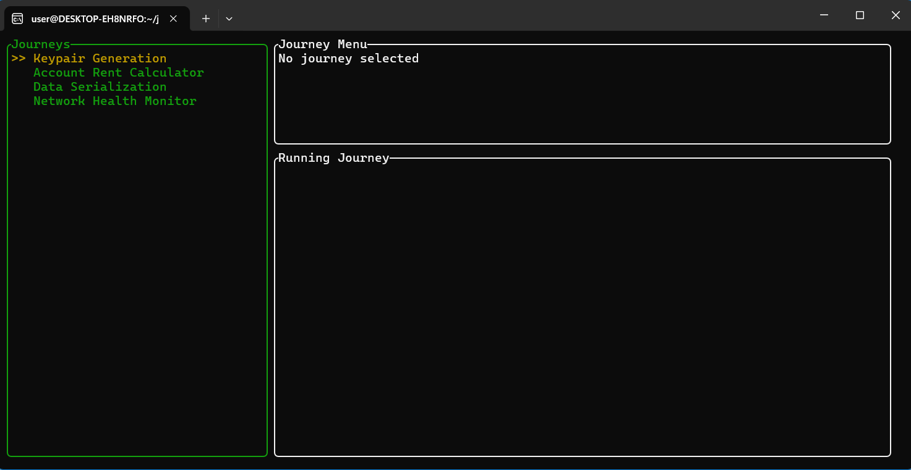

# CLI - Rust Journeys Implementations

## Why this project?
A terminal-based user interface for managing and tracking coding learning journeys. Journey UI is a TUI (Text-based User Interface) application built with Rust that helps developers organize and progress through coding learning paths. The application provides a structured way to visualize, select, and track different learning journeys.

**What is a Journey?**
In this application, "Journeys" represent discrete learning paths or coding challenges that help you develop specific skills. Each journey includes: - A descriptive name - Difficulty level - A detailed description of what you'll learn/implement The current journeys focus on developing skills such as: - Cryptographic key generation - Account rent calculation - Data serialization with Borsh - Network health monitoring Journeys are designed to be modular, focused learning experiences that build practical implementation skills.

## Screenshots

## How to run?

**Prerequisites**
> Rust and Cargo (latest stable version) 
> Any terminal that supports TUI applications

**Installation**

    bash  

    git clone https://github.com/your-username/journey-ui.git 
    cd journey-ui  
    cargo build --release
    cargo run --release

